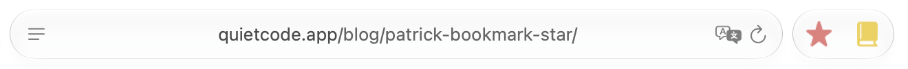
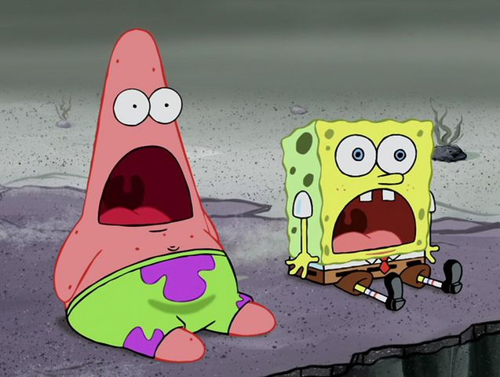

# Patrick: a Chrome like bookmark star for Safari

You know the Chrome star? Safari on the Mac has nothing like it.

Patrick is a free Safari extension that adds a bookmark button that works just like Chrome's. I also added a similar button for Safari's Reading List.

[Realease](https://github.com/quietcodeapp/patrick-app/releases) | Developed by [QuietCode](https://quietcode.app)

## Compared with other extensions

Some similar extensions can show whether a page is bookmarked, but the app sandbox stops them from writing to Safari's bookmarks, so they are only an indicator, not an interactive button.

## Install

Get the latest `Patrick-x.y.dmg` from the [Releases](../../releases/latest) page. It is signed and notarized.

## How it works

Safari has no public API for adding bookmarks, so Patrick merges bookmark/reading list into and out of `~/Library/Safari/Bookmarks.plist` (hence Full Disk Access).

## Known limitations

- Safari's bookmark manager or Favorites UI may not refresh immediately if added bookmark through the extension.

## My inspiration

## License

[GPL-3.0](LICENSE)
